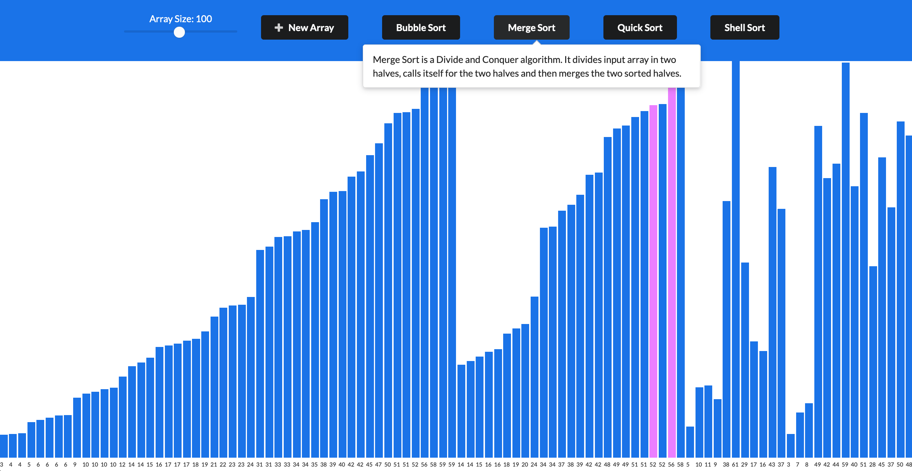

# Sorting Visualizer

# 

## What is Sorting Visualizer?
Sorting Visualizer is a web app that shows how elements within an array are sorted based on their natural order. Here the element value is represented by the size of the bar and the algorithms sort them by placing the smallest elements on the left and the biggest elements on the right. The algorithms moves the items around by swapping elements, never creating another array.

### Sorting Algorithms:
* Bubble Sort
* Merge Sort
* Quick Sort
* Shell Sort

## Built with
NodeJS, Build-React-App, React, Fun!

## Demo
Here is a working live demo : https://jbmerville.github.io/Sorting-Visualization/

